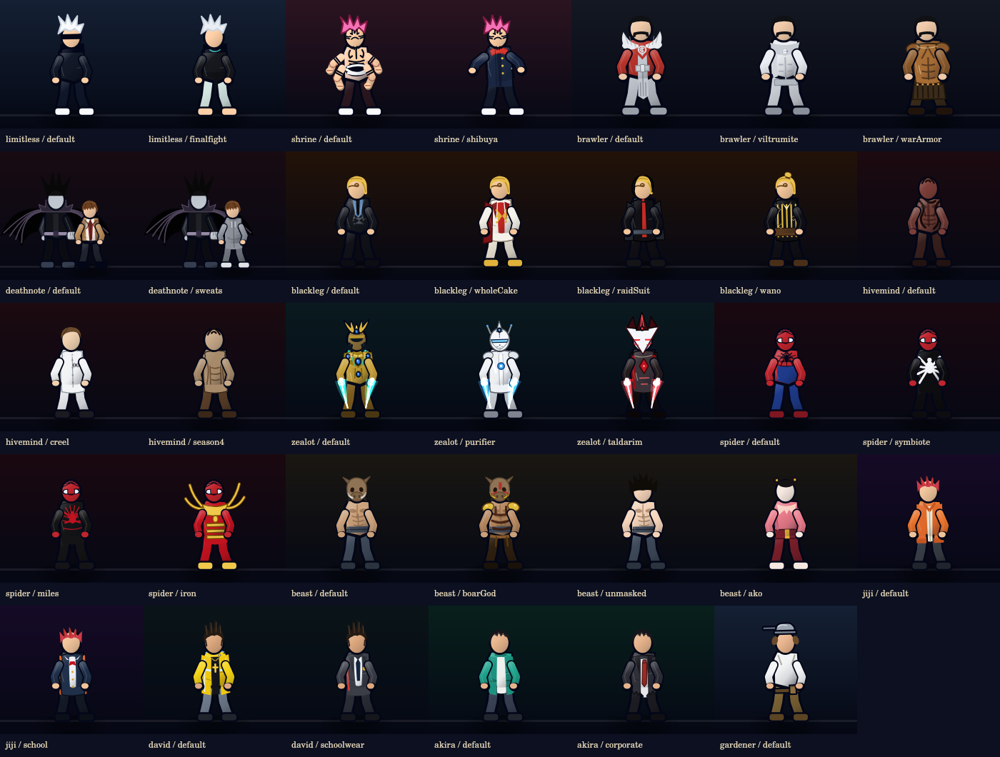
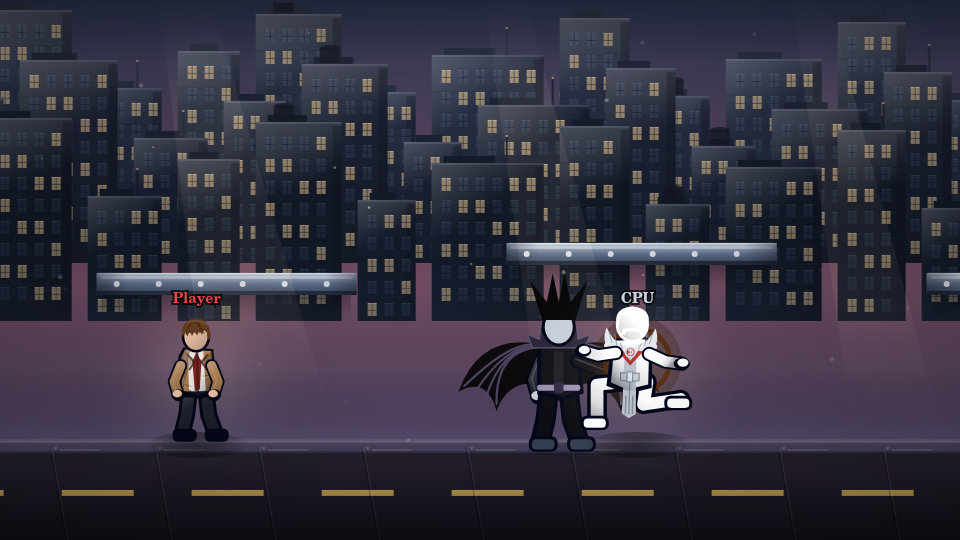

# Light rework and visual polish

Practice's No Cooldowns option now clears all character ability cooldowns, including plant timers and technique locks. Attack recovery and active animation duration still apply.

## Light

- **Shinigami Strike:** Ryuk flies to the aimed point, punches from beside it, then flies back. Only his fist can hit. The HUD uses the full ability name.
- **Melee:** Ryuk performs Light's punches, heavy punches, and throw. Light keeps his arms relaxed.
- **Investigation:** the red preview and summon use the same endpoint, within a 240-unit radius. Airborne summons fall onto the stage or platforms.
- **Misa:** 45 HP; 0.15 base Name progress per tick near the opponent.
- **Soichiro Yagami:** 130 HP; 0.08 base Name progress per tick near the opponent. Both rates are about 38% slower than before; existing information/proximity modifiers still apply.
- **Potato Chip:** a 40-tick eating animation, the existing heal and ten-second Focus effect. Focus advances running combat cooldowns twice as quickly; Potato Chip's own cooldown is unchanged. Name gain gets a 30% boost while a summon is active.
- **Death Note:** one new writing animation. The Name bar is consumed on use, and damage resolves once after 84 ticks of writing. Remote players receive the same animation state without applying duplicate damage.

## Artwork

All 34 existing skins remain, with clothing shading, material highlights, seams, and costume details. The faceless style retains Sukuna's tattoos, Thragg's mustache, and Sanji's curly eyebrow on every Sanji skin. Costume masks remain part of their outfits.

Stages have finished platform surfaces and more detailed city buildings. Moving projectiles have directional trails. Every cooldown row shares the same gold palette.

## Validation

Run `npm ci`, `npm run check`, and `npm test` with Node 18 or newer. Eleven regression tests cover cooldowns, summon placement and balance, Potato Chip, Ryuk movement and hit detection, ultimate timing, multiplayer serialization, and roster/stage rendering.

The previews were rendered from the game's actual canvas drawing code. Browser interaction, mobile layout, and a live two-player session still need a manual playtest; the preview browser could not reach the local server during this change.
